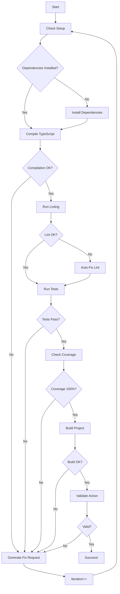

# Test Automation System

## Overview

This comprehensive build-to-test system enables unattended iterative development and testing for the GH-Workflow-Issue-Creator GitHub Action. The system automatically identifies issues, suggests fixes, and validates the entire codebase until everything works correctly.

## Quick Start

### First-Time Setup
```bash
# Initial setup (installs dependencies, builds, tests)
npm run setup:first-time

# Quick validation
npm run quick-test

# Full automation (iterates until all tests pass)
npm run automate
```

## Components

### 1. Setup Script (`scripts/setup-project.ts`)
Handles initial project setup:
- Installs dependencies (creates package-lock.json)
- Runs initial tests
- Builds distribution (creates dist/)
- Validates setup
- Generates setup report

**Usage:**
```bash
npm run setup:first-time
```

### 2. Quick Test (`scripts/quick-test.ts`)
Fast validation of project state:
- ✅ Checks project structure
- ✅ Validates TypeScript compilation
- ✅ Runs linting
- ✅ Executes tests
- ✅ Checks coverage
- ✅ Validates build
- ✅ Security checks

**Usage:**
```bash
npm run quick-test
```

**Output:** `quick-test-report.json`

### 3. Test Harness (`scripts/test-automation/testHarness.ts`)
Core automation engine that:
- Runs through all validation phases
- Identifies specific errors
- Generates fix requests
- Tracks coverage metrics
- Validates GitHub Action configuration

### 4. Automation Runner (`scripts/test-automation/automationRunner.ts`)
Orchestrates iterative testing:
- Runs up to 50 iterations (configurable)
- Auto-fixes common issues
- Generates detailed reports
- Tracks progress across iterations

**Usage:**
```bash
npm run automate

# With options:
npm run automate -- --max-iterations 10 --no-auto-fix --quiet
```

**Options:**
- `--max-iterations <n>`: Maximum iterations (default: 50)
- `--no-auto-fix`: Disable automatic fixes
- `--quiet`: Reduce output verbosity
- `--continue-on-success`: Continue even after success
- `--pause <ms>`: Pause between iterations (default: 1000)

## Test Coverage

### Unit Tests
- `tests/index.test.ts` - Main action entry point
- `tests/context.test.ts` - GitHub context builder
- `tests/redact.test.ts` - Sensitive data redaction
- `tests/render.test.ts` - Template rendering
- `tests/category.test.ts` - Category detection
- `tests/config.test.ts` - Configuration loading
- `tests/fingerprint.test.ts` - Fingerprint generation
- `tests/issue-manager.test.ts` - Issue management

### Integration Tests
- `tests/integration/action-runner.test.ts` - Full action execution simulation

## Automation Workflow



## Fix Request System

When tests fail, the system generates `.fix-request.json`:

```json
{
  "iteration": 3,
  "phase": "coverage",
  "errors": [
    {
      "type": "coverage",
      "file": "src/index.ts",
      "message": "Statement coverage is 87.5%, needs 100%",
      "suggestion": "Add tests for uncovered statements"
    }
  ],
  "coverage": {
    "statements": 87.5,
    "branches": 92.3,
    "functions": 95.0,
    "lines": 88.2
  },
  "nextSteps": [
    "Add tests for uncovered code",
    "Check coverage report for details"
  ]
}
```

## Reports

### Setup Report (`setup-report.json`)
```json
{
  "timestamp": "2024-01-01T12:00:00Z",
  "success": true,
  "environment": {
    "node": "v18.0.0",
    "platform": "linux",
    "arch": "x64"
  },
  "files": {
    "packageLockExists": true,
    "distExists": true
  }
}
```

### Automation Report (`automation-report.json`)
```json
{
  "totalIterations": 5,
  "successful": true,
  "finalPhase": "complete",
  "finalCoverage": {
    "statements": 100,
    "branches": 100,
    "functions": 100,
    "lines": 100
  }
}
```

## Configuration

Edit `test-automation.config.json` to customize:

```json
{
  "automation": {
    "maxIterations": 50,
    "autoFix": true,
    "verbose": true
  },
  "coverage": {
    "statements": 100,
    "branches": 100,
    "functions": 100,
    "lines": 100
  }
}
```

## Success Criteria

The project is considered working when:
1. ✅ Dependencies installed (package-lock.json exists)
2. ✅ TypeScript compiles without errors
3. ✅ All unit tests pass
4. ✅ 100% code coverage achieved
5. ✅ Build creates valid dist/index.js
6. ✅ Integration tests pass
7. ✅ Action.yml validated
8. ✅ No security vulnerabilities

## Troubleshooting

### Tests Won't Run
```bash
# Ensure dependencies are installed
npm install

# Check Node version (must be 18+)
node --version
```

### Coverage Not Meeting 100%
```bash
# See detailed coverage report
npm test -- --coverage

# Check which files need tests
cat coverage/coverage-final.json
```

### Build Fails
```bash
# Check TypeScript errors
npx tsc --noEmit

# Try manual build
npm run build
```

### Automation Stuck
```bash
# Check fix request
cat .fix-request.json

# Review automation log
cat test-automation.log

# Run with fewer iterations
npm run automate -- --max-iterations 5
```

## Manual Testing

### Test Individual Components
```bash
# Just compile
npx tsc --noEmit

# Just lint
npm run lint

# Just tests
npm test

# Just build
npm run build
```

### Run Specific Test Files
```bash
# Single test file
npx vitest run tests/index.test.ts

# Integration tests only
npm run test:integration

# With watch mode
npx vitest tests/index.test.ts --watch
```

## Continuous Development Workflow

1. **Make changes** to source code
2. **Run quick test** for fast feedback:
   ```bash
   npm run quick-test
   ```
3. **Run automation** for comprehensive validation:
   ```bash
   npm run automate
   ```
4. **Review reports** if failures occur:
   - `.fix-request.json` - Specific issues to fix
   - `test-automation.log` - Detailed execution log
   - `automation-report.json` - Summary report

5. **Fix issues** based on suggestions
6. **Repeat** until all tests pass

## Next Steps

Once the automation succeeds:

1. **Commit changes:**
   ```bash
   git add package-lock.json dist/
   git commit -m "build: initial setup with dependencies and distribution"
   ```

2. **Test in real workflow:**
   ```yaml
   - uses: ./
     with:
       github-token: ${{ secrets.GITHUB_TOKEN }}
   ```

3. **Create release:**
   ```bash
   git tag v0.1.0
   git push origin v0.1.0
   ```

## Support

- Check `test-automation.log` for detailed execution logs
- Review `.fix-request.json` for specific issues
- See individual test files for test implementation details
- Configuration in `test-automation.config.json`

---

*This test automation system ensures the GH-Workflow-Issue-Creator action is thoroughly tested and working before deployment.*